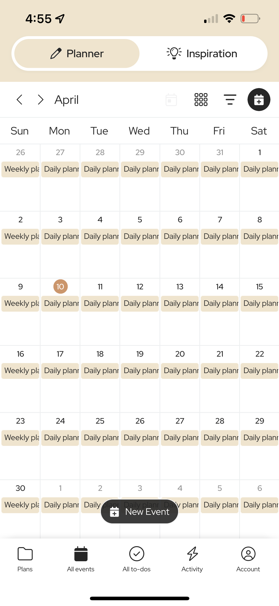
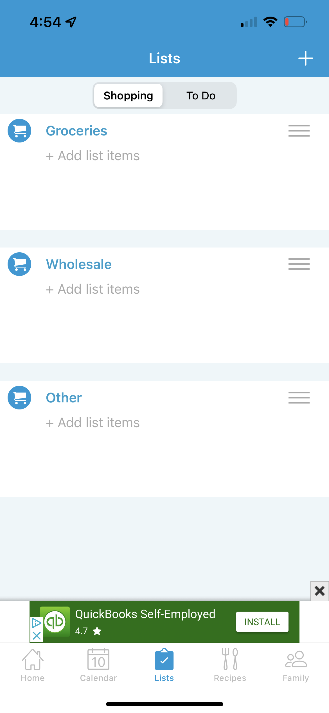

# Motivating and Encouraging Family Connection

# Assignment 1: Heuristic Evaluation

Alonzo Murrieta, DH110, Spring 2023

The discussion of mental health widely varies across cultures and families.
It often occurs where children of traditional families are shunned for speaking on topics such
as anxiety, depression, or other mental issues, and it is often the case where older figures in traditional families
were not properly taught what these topics may mean and their severity. This goes to say that the amount
at which families are comfortable in communicating their own thoughts and emotions to eachother is different to each family.
This disucssion motivated me to explore the design of current family connection apps and attempt to improve
the UX design by implementing features that encourages families to connect with eachother on a deeper emotional level.

<h3> Maple </h3>
<table>
  <tr>
    <td>  </td>
    <td>  </td>
    <td>  </td>
    <td>  </td>
    <td>  </td>
  </tr>
</table>
<h4> https://www.growmaple.com/ </h4>
Maple is a family planning app that allows for users to create family groups and share features such as a calendar, to-do list, activity board, plans. The app also includes a "inspiration" feature that allows users to view various activities that can be done with family members as well as recipes that can be shared with all. 
Overall, I think Maple is a well designed app that properly provides opportunity for families to connect and get organized. The UI is aesthetically pleasing and does not feel too abundant even though there are plenty of features in the app.

<h3> Cozi </h3>
<table>
  <tr>
    <td>  </td>
    <td>  </td>
    <td>  </td>
    <td>  </td>
    <td>  </td>
  </tr>
</table>
<h4> https://www.cozi.com/ </h4>
Cozi is a family planning app similar to Maple that allows for users to create family groups and share lists, calendar events, and recipes. The app has an extensive list of recipes pre-loaded that users can cook with their families.
Overall, I believe Cozi is a decent family organizing app. However, there is much to be desired in the UI of Cozi, which feels very cluttered and blunt. When compared to Maple, Cozi is a step down in terms of appearance and available features.

<h2> Heuristic Evaluation </h2>

Below will be a brief description of the 10 heuristics used to evaluate Maple and Cozi, with the severity scale provided as well.

<h3> Severity Ratings </h3>
<table>
  <tr>
    <td> Severity </td>
    <td> Meaning </td>
  </tr>
  <tr>
    <td> 0 </td>
    <td> This is not a usability problem. </td>
  </tr>
  <tr>
    <td> 1 </td>
    <td> Cosmetic problem only: need not be fixed unless extra time is available on project </td>
  </tr>
  <tr>
    <td> 2 </td>
    <td> Minor usability problem: fixing this should be given low priority </td>
  </tr>
  <tr>
    <td> 3 </td>
    <td> Major usability problem: important to fix, so should be given high priority </td>
  </tr>
  <tr>
    <td> 4 </td>
    <td> Usability catastrophe: imperative to fix this before product can be released </td>
  </tr>
</table>

<h3> The 10 Heuristics </h3>

<h4> Visibility of system status </h4>
The design of a system should keep users in the know about where their interactions with the system have led them, and where they may be able to move forward with next steps.

<h4> Match between system and the real world </h4>
The design of a system should communicate to the user through conventions that are familiar to the user. 

<h4> User control and freedom </h4>
In the event a user performs an unwanted or accidental action, the design of a system should allow the user to easily exit and step back from the action they have performed.

<h4> Consistency and standards </h4>
The design of a system should follow the standards that similar systems have.

<h4> Error prevention </h4>
Well-designed systems typically prevent errors from ever occuring. In the event a system requires a process that may result in an error, it is encouraged to implement preventions so that such errors are unable to occur.

<h4> Recognition rather than recall </h4>
A system's design should be easily accessible in any step without the need for additional or previous information. Information should be easily realized by the user.

<h4> Flexibility and efficiency of use </h4>
The design of a system should allow for users with varying levels of experience to be acknowledged by providing various methods to perform a specific action.

<h4> Aesthetic and minimalist design </h4>
A well-designed system will contain only the information that is necessary and relevant to the user. 

<h4> Help users recognize, diagnose, and recover from errors </h4>
In the event where an error occurs, the system should inform the user of the exact issue as well as provide a solution if possible.

<h4> Help and documentation </h4>
The need for additional explanation in a system is typically undesired. In the event where additional documentation is necessary, it is expected that this documentation is easy to navigate and search.

<h2> Evaluation </h2> 

<h3> Maple </h3>

<h3> Cozi </h3>
