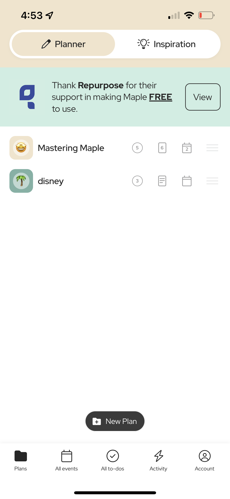
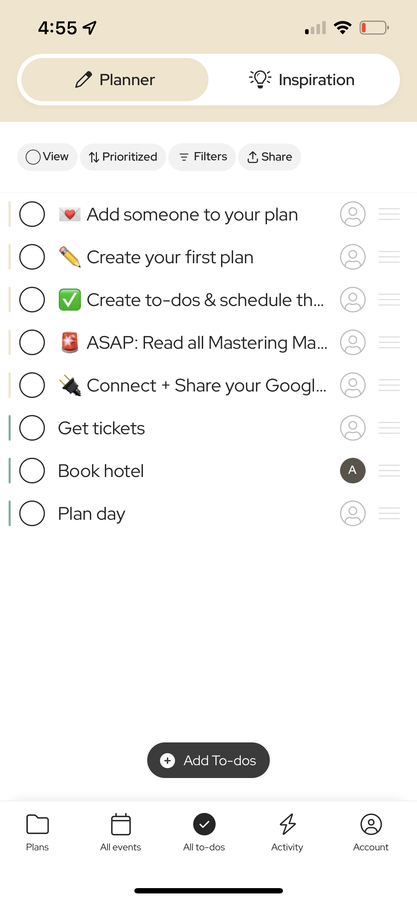
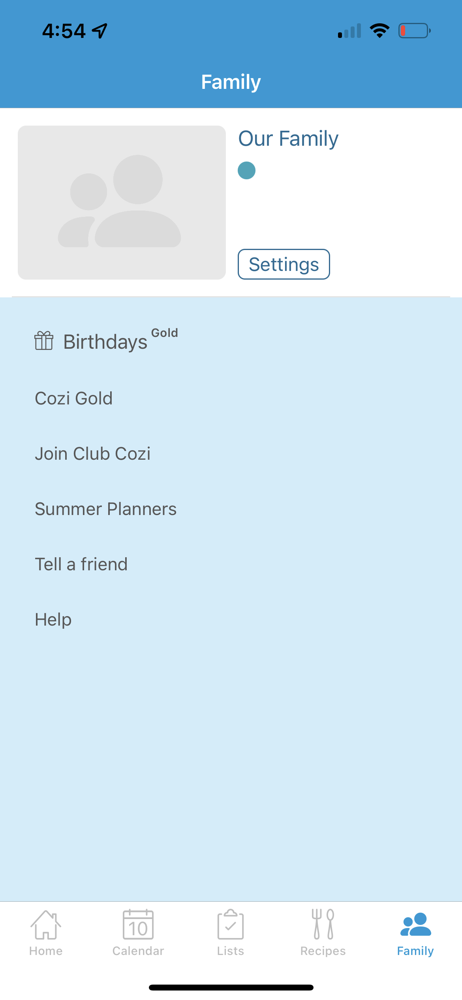
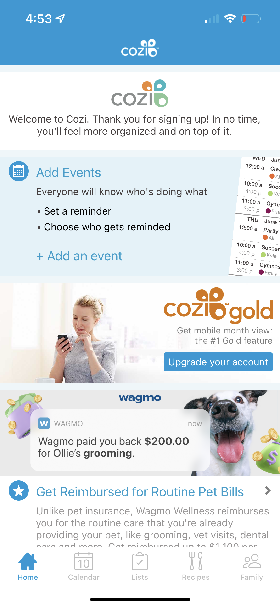

# Motivating and Encouraging Family Connection

# Assignment 1: Heuristic Evaluation

Alonzo Murrieta, DH110, Spring 2023

The discussion of mental health widely varies across cultures and families.
It often occurs where children of traditional families are shunned for speaking on topics such
as anxiety, depression, or other mental issues, and it is often the case where older figures in traditional families
were not properly taught what these topics may mean and their severity. This goes to say that the amount
at which families are comfortable in communicating their own thoughts and emotions to eachother is different to each family.
This disucssion motivated me to explore the design of current family connection apps and attempt to improve
the UX design by implementing features that encourages families to connect with eachother on a deeper emotional level.

<h3> Maple </h3>
<table>
  <tr>
    <td>  </td>
    <td>  </td>
    <td>  </td>
    <td>  </td>
    <td>  </td>
  </tr>
</table>
<h4> https://www.growmaple.com/ </h4>
Maple is a family planning app that allows for users to create family groups and share features such as a calendar, to-do list, activity board, plans. The app also includes a "inspiration" feature that allows users to view various activities that can be done with family members as well as recipes that can be shared with all. 
Overall, I think Maple is a well designed app that properly provides opportunity for families to connect and get organized. The UI is aesthetically pleasing and does not feel too abundant even though there are plenty of features in the app.

<h3> Cozi </h3>
<table>
  <tr>
    <td>  </td>
    <td>  </td>
    <td>  </td>
    <td>  </td>
    <td>  </td>
  </tr>
</table>
<h4> https://www.cozi.com/ </h4>
Cozi is a family planning app similar to Maple that allows for users to create family groups and share lists, calendar events, and recipes. The app has an extensive list of recipes pre-loaded that users can cook with their families.
Overall, I believe Cozi is a decent family organizing app. However, there is much to be desired in the UI of Cozi, which feels very cluttered and blunt. When compared to Maple, Cozi is a step down in terms of appearance and available features.

<h2> Heuristic Evaluation </h2>

Below will be a brief description of the 10 heuristics used to evaluate Maple and Cozi, with the severity scale provided as well.

<h3> Severity Ratings </h3>
<table>
  <tr>
    <td> Severity </td>
    <td> Meaning </td>
  </tr>
  <tr>
    <td> 0 </td>
    <td> This is not a usability problem. </td>
  </tr>
  <tr>
    <td> 1 </td>
    <td> Cosmetic problem only: need not be fixed unless extra time is available on project </td>
  </tr>
  <tr>
    <td> 2 </td>
    <td> Minor usability problem: fixing this should be given low priority </td>
  </tr>
  <tr>
    <td> 3 </td>
    <td> Major usability problem: important to fix, so should be given high priority </td>
  </tr>
  <tr>
    <td> 4 </td>
    <td> Usability catastrophe: imperative to fix this before product can be released </td>
  </tr>
</table>

<h3> The 10 Heuristics </h3>

<h4> Visibility of system status </h4>
The design of a system should keep users in the know about where their interactions with the system have led them, and where they may be able to move forward with next steps.

<h4> Match between system and the real world </h4>
The design of a system should communicate to the user through conventions that are familiar to the user. 

<h4> User control and freedom </h4>
In the event a user performs an unwanted or accidental action, the design of a system should allow the user to easily exit and step back from the action they have performed.

<h4> Consistency and standards </h4>
The design of a system should follow the standards that similar systems have.

<h4> Error prevention </h4>
Well-designed systems typically prevent errors from ever occuring. In the event a system requires a process that may result in an error, it is encouraged to implement preventions so that such errors are unable to occur.

<h4> Recognition rather than recall </h4>
A system's design should be easily accessible in any step without the need for additional or previous information. Information should be easily realized by the user.

<h4> Flexibility and efficiency of use </h4>
The design of a system should allow for users with varying levels of experience to be acknowledged by providing various methods to perform a specific action.

<h4> Aesthetic and minimalist design </h4>
A well-designed system will contain only the information that is necessary and relevant to the user. 

<h4> Help users recognize, diagnose, and recover from errors </h4>
In the event where an error occurs, the system should inform the user of the exact issue as well as provide a solution if possible.

<h4> Help and documentation </h4>
The need for additional explanation in a system is typically undesired. In the event where additional documentation is necessary, it is expected that this documentation is easy to navigate and search.

<h2> Evaluation </h2> 

<h3> Maple </h3>

<h4> Visibility of system status </h4>
Both the planner and inspiration pages in Maple provide the user with an idea of what each page may hold. Every feature, such as adding a new plan and assigning family members to certain to-dos, provides the user with instruction on how to proceed. <b> Severity Rating: 0 </b>

<h4> Match between system and the real world </h4>
Most pages and almost all actions in Maple are shown by a pairing of a word and icon related to that word. For example, the all to-dos list mimics that of a to-do list one would make themselves, allowing you to check off items and assign family users to a specific task. <b> Severity Rating: 0 </b>

<h4> User control and freedom </h4>
Almost all actions in Maple are performed in a pop-up window that contains an X or arrow indicating to the user that they may go back and undo their action. <b> Severity Rating: 0 </b>

<h4> Consistency and standards </h4>
The design of Maple similarly follows the standards that other family planning apps have. These standards typically consist of a calendar of upcoming events to which you can add, and a to-do list page.
<b> Severity Rating: 0 </b>

<h4> Error prevention </h4>
During my trial run of Maple I did not encounter any errors nor did the app ever stop working.
<b> Severity Rating: 0 </b>

<h4> Recognition rather than recall </h4>
Many buttons and actionable items in Maple contain both a word and icon describing what the specific item performs. This combination of words and associated icons throughout the app allow for the user to get a better idea of how to navigate different areas of the app.
<b> Severity Rating: 0 </b>

<h4> Flexibility and efficiency of use </h4>
Maple seems to have no flexibility in the actions a user can perform. All actions must be performed with the same steps every time.
<b> Severity Rating: 2 </b>

Suggestion: Implement ways to allow users to maximize their efficiency if they want to. For example, it may be helpful to be able to create a list and at the same time add starter items to a list.

<h4> Aesthetic and minimalist design </h4>
Maple's design is clean and minimal, it only shows what is necessary and relevant to the user.
<b> Severity Rating: 0 </b>

<h4> Help users recognize, diagnose, and recover from errors </h4>
During my trial run of Maple I did not encounter any errors nor did the app ever stop working.
<b> Severity Rating: 0 </b>

<h4> Help and documentation </h4>
Help and documentation for Maple is hosted on an external site outside of the app. Documentation is fleshed out and easy to navigate.
<b> Severity Rating: 2 </b>

Suggestion: Although help and extra documentation can be found in the app, it would be easier for the user if the Maple Tips and FAQ tab under the Account page was not a redirect link and instead a page within the app.

<h3> Cozi </h3>

<h4> Visibility of system status </h4>
Each page and action in Cozi gives the user an idea of where they are in the app. Each page contains actions that the user can perform and not worry about redirection to other sections of the app.
<b> Severity Rating: 0 </b>

<h4> Match between system and the real world </h4>
The conventions used in Cozi similarly follow real world conventions. For example, Lists, Recipes, and Calendar are accompanied with icons that give the user an idea of what exactly each page function serves. 
<b> Severity Rating: 0 </b>

<h4> User control and freedom </h4>
Users may delete of go back on actions they did not intend to perform. Each action is Cozi is accompanied with a pop-up tab that gives users the ability to cancel their action.
<b> Severity Rating: 0 </b>

<h4> Consistency and standards </h4>
The design of Cozi similarly follows the standards that other family planning apps have. These standards typically consist of a calendar of upcoming events to which you can add, and a to-do list page.
<b> Severity Rating: 0 </b>

<h4> Error prevention </h4>
During my trial run of Cozi I did not encounter any errors nor did the app fail to properly work.
<b> Severity Rating: 0 </b>

<h4> Recognition rather than recall </h4>
Within Cozi there are many actions a user can perform. Within each action such as adding an item to a list, it often occurs that the corner of each action contains a + sign and vertical dots. The design is poor in this regard since the user has to experiment with the interface before they can actually understand what actions are performed. For example, the activity of sharing a list is not entirely clear to a new user.
<b> Severity Rating: 2 </b>

Suggestion: Take a look at Maple's design to gather inspiration on how to properly connect action words with existing icons the user may be familiar with.

<h4> Flexibility and efficiency of use </h4>
Cozi leaves no room for flexibility in the actions a user can perform. Each action typically takes a 3-4 steps and there are seemingly no shortcuts available in the app that experienced users can take.
<b> Severity Rating: 2 </b>

Suggestion: Implement ways to allow users to maximize their efficiency if they want to. For example, it may be helpful to be able to create a list and at the same time add starter items to a list.

<h4> Aesthetic and minimalist design </h4>
Cozi's UI is cluttered with advertisements for Cozi Gold and other companies ads. Features like a month view for the calendar page are visibly locked out and advertise Cozi Gold when clicked. Also, the Agenda page, recipe page, and home page provide too much information to the user without proper spacing.
<b> Severity Rating: 3 </b>

Suggestion: Remove the abundance of advertisements and give proper spacing and borders to components that do not interact with eachother.

<h4> Help users recognize, diagnose, and recover from errors </h4>
During my trial run of Cozi I did not encounter any errors nor did the app fail to properly work.
<b> Severity Rating: 0 </b>

<h4> Help and documentation </h4>
Help and external documentation can be found within the Cozi app under the Family page and the Help tab. Documentation is fleshed out and easy to navigate.
<b> Severity Rating: 0 </b>
