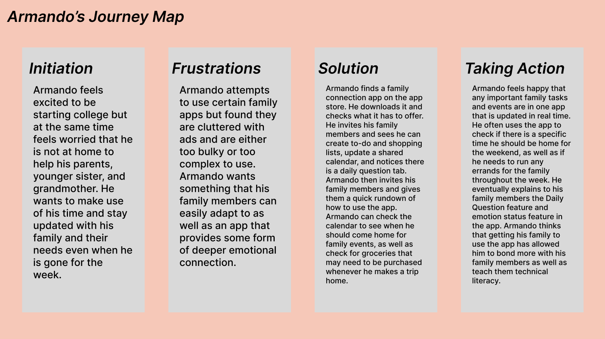

<h1>The Purpose of UX Storytelling</h1>
My project aims to find way for family members to better connect in a digital space. Through UX Storytelling, designers create personas of product end users in order to change their perspectives to what an actual user of a product may have envisioned. By creating personas, designers can have a shared and concrete view of the first users on their platform. 

<h1>Personas & Empathy Maps</h1>

<h1>Features & Journey Maps</h1>
<h2>Feature 1</h2>
Share event plans and lists with family.
<h3>Why Armando is using this product:</h3>
Armando is in the beginning of his first year at college. Although he comes home often during the weekends, Armando is still missing his family and feels a need to go back home and help out his parents, his little sister, and his grandmother. Though Armando understands that finishing college is his priority, he still feels the need to help out his family in any way he can. Armando wants to get his family to all use a simple phone app that allows family members to share upcoming events, shopping lists, as well as tell each other how they are feeling.
<h3>How Armando is using this product:</h3>
On Friday afternoon, Armando packs his bags and gets ready to go home. Armando opens the app and checks if there are any family events going on this weekend, he sees there are a couple of appointments but no large events planned. He then checks the shopping list tab and sees there are a couple items he could pick up from the grocery store on the way home. After picking up the items, he marks them off the shopping list and a notification is sent to his family members.

<h2>Feature 2</h2>
Share daily question answers with family, update mood chart.
<h3>Why Julie is using this product:</h3>
Julie just moved into a new apartment a couple weeks ago and has just started a new job as a consultant in Los Angeles. After being home for the entire summer after her college graduation, Julie feels happy that she was able to spend some time again living with her parents. However, lately Julie feels like adapting to a new living situation and starting a new job has heavily reduced amount of time she has to spend and talk with her parents. To help alleviate these worries, Julie wants to use an app that allows her and her parents to communicate in smaller ways even if in a lack of time.
<h3>How Julie is using this product:</h3>
Every morning right before clocking into work, Julie opens the app and answers a daily question such as “What has been your favorite family vacation?”. At the end of the busy day she sees that her mom and dad have answered the question, and she gets to read their answers. Also, Julie can check the state of emotions of her family members, which are asked of after answering the daily question. She sees that both of her parents clicked the happy emoji and feels instantly relieved that all is going well at home.

