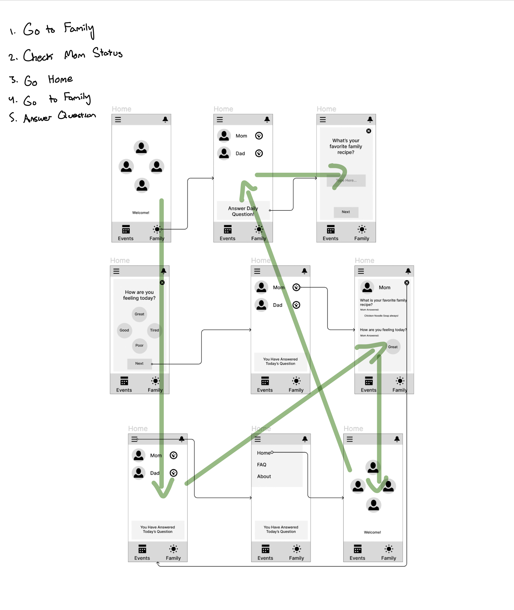
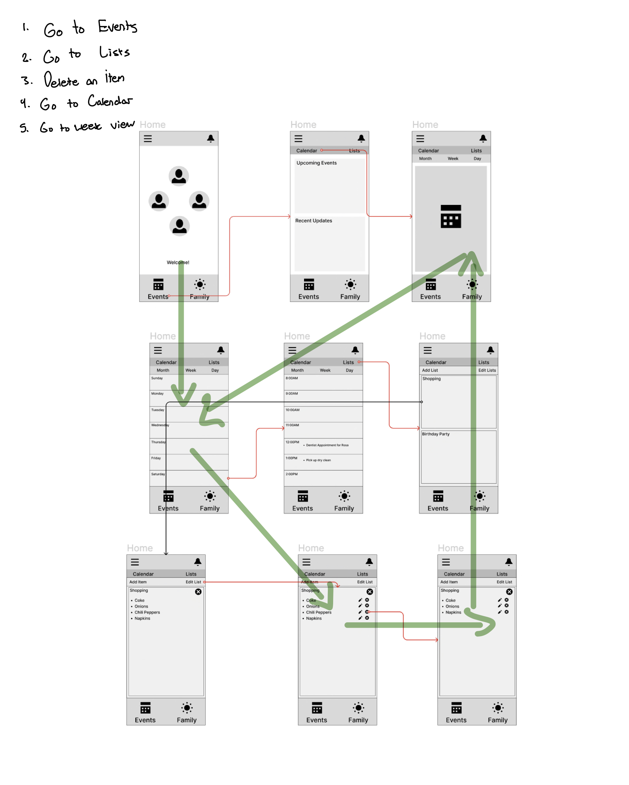

<h1>Low-Fidelity Prototyping</h1>
My project is a family-connection app that serves to offer users the ability to create groups with their family.
In the app, users are able to invite family members, edit a shared calendar, edit shared lists, as well as answer daily wellness questions and view other family member's answers and status.
The purpose of this low-fidelity prototype is to give myself the ability to view the first possible UX design of the proposed app.
By creating a low-fidelity prototype, designers are able to view and hash out the pages and functionality in an app without actually developing it.
This method saves designers time, and gives them the ability to have other users test specific tasks and provide early feedback.

<h2>Supported Tasks</h2>
The current prototype can support two tasks:
The first task shows the functionality of the wellness tab.

1. Go to Wellness Tab
2. Select "Answer Daily Question"
3. Answer Daily Question
4. Check Family Member Emotion
5. Go to Home Tab
  

The second task shows the functionality of the events tab.
1. Check Planning Tab
2. Check Calendar
3. Sort to week view
4. See events posted
5. Go Back
6. Check Lists
7. See Grocery List
8. Click off an Item

<h2>Prototypes</h2>
<h3>Task 1: Answering Wellness Question & Viewing Family Status</h3>

<h3>Task 2: Viewing Events Tab and Editing a List</h3>

<h2>Testing</h2>
<h3>Testing Family Tab</h3>

<h3>Testing Events Tab</h3>

<h2>Testing Results</h2>
The user testing resulted in a few key findings. In both the family and event tasks, the tester moved to a different screen than intended to start their tasks. Performing the actions themselves, such as answering the daily question, removing an item from the list, and checking a family member's status all seemed relatively trivial for the tester. In the future, it may prove useful to improve the design by adding additional indicators to each interactable item by providing box outlines or icons to indicate what the user can click and what is solely for reading. Another finding was that the user did not make use of the side bar tab to go home, which may lead to confusion for later users if not changed. I would revise the prototype by giving color to specific items to indicate user progress and user emotional status. Also, I would implement a clearer indicator to whether or not a user has answered the daily question, and perhaps make better use of the notifications in the top rights.

