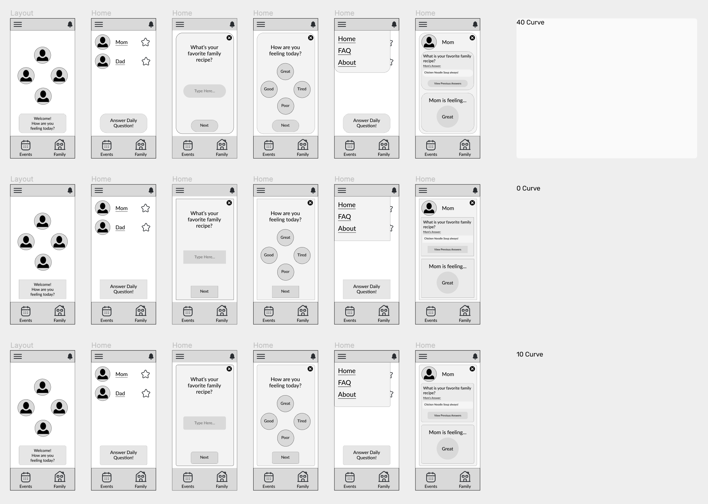

<h1>Interface Design</h1>
<h2>Project Description</h2>
The purpose of this project is to create a family connection app that incorporates the functionality of existing family organizational apps such as Cozi or Maple with extra features that motivate and support deeper emotional bonds between family members. Currently existing family apps serve as great bases for families looking to better organize events or keep a consolidated list of information for each member to see. However, many of these existing apps lack features that allow family members the opportunity to connect with each other and stay in tune with each other’s emotions even through a digitized space. The proposed app serves as a digital bridge for family members to connect, stay organized, and open conversations about each others emotions in an increasingly faster paced world. Good interface design will allow family members of all ages to participate and quickly pick up on the functions in the app and in turn learn more about each other through the use of specific features.

<h2>Digitized Wireflow</h2>
<a href="https://www.figma.com/file/TovH3HwMOyu7whBS2J3CIy/DH110Assignment6?type=design&node-id=0%3A1&t=YkLNr4qZ4VM0UQ2X-1">Link to Digitized Wireflow</a>

<h2>Graphical User Interface Design Variation</h2>
<h3>Layout</h3>

<h3>Typography</h3>

<h3>Shape</h3>

<h3>Colors</h3>

<h2>Final Graphical Interface Design</h2>
The Final Graphical Interface Design was created by first picking layout, typography, shape variation, and lastly color scheme. After choosing the pastel pink and tan for the final color scheme it became apparent that there was an abundance of blank space in the app. To minimize this, I implemented additional rounded rectangles to serve as component frames for groups of text and image. The final color scheme was also slightly tweaked in order to provide better shadowing and still allow for the user to distinguish between objects.

<h2>Accessibility Check</h2>
<table>
  <tr>
    <td></td>
    <td></td>
    <td></td>
  </tr>
</table>

<h2>Impression Test</h2>
In order to quickly test the app's interface design, I conducted a few impression tests that resulted in the following feedback:
After showing them the proposed final graphical interface design, I asked 3 users to provide a simple line of feedback:

"It looks clean, and the color flows nicely."

"There is a lot going on on the last page, the other pages look more minimalistic."

"There's outlines on every shape, I'm not sure how I feel about that. I think it works in some cases but it made things feel cluttered."

Impression Testing allowed me to understand that users are well adjusted to a minimalistic design given the typography, shape variation, and color scheme used in the design. The soft pastel color palette and lack of intensive coloring used as the makeup for the app's interface gave the users the impression of a minimalistic design by providing them with a unharsh screen. I learned that the stroke outlines around every component may not be necessary and can show to clutter up the interface. The proposed improvement is to make use of other effects such as drop shadow to allow components to pop out while staying in unison with the minimalistic design. 

<h2>Design Summary</h2>
<h3>Layout</h3>
6 Rows, 8% Opacity, 30 Margin, 15 Gutter
3 Columns, 8% Opacity, 15 Margin, 20 Gutter
<h3>Typography</h3>
Lato, 3% Letter Spacing, 32 Line Spacing, Regular

Sidebar: 40px

Button: 28px, 32 Line Spacing

Title Text: 32px, 36 Line Spacing

Paragraph Text: 24px, 30 Line Spacing

Sub Text: 16px

Main Tabs (Event, Family): 26px
<h3>Shape</h3>
Component Curve Radius: 40
<h3>Color</h3>
Background: FCF2ED

Top/Botton Bar: F8DBCA

Button: F9E9E4

Component: FFE4DB

<h2>Link to Interface Design</h2>
<a href="https://www.figma.com/file/TovH3HwMOyu7whBS2J3CIy/DH110Assignment6?type=design&node-id=0%3A1&t=YkLNr4qZ4VM0UQ2X-1">Interface Design Page</a>

