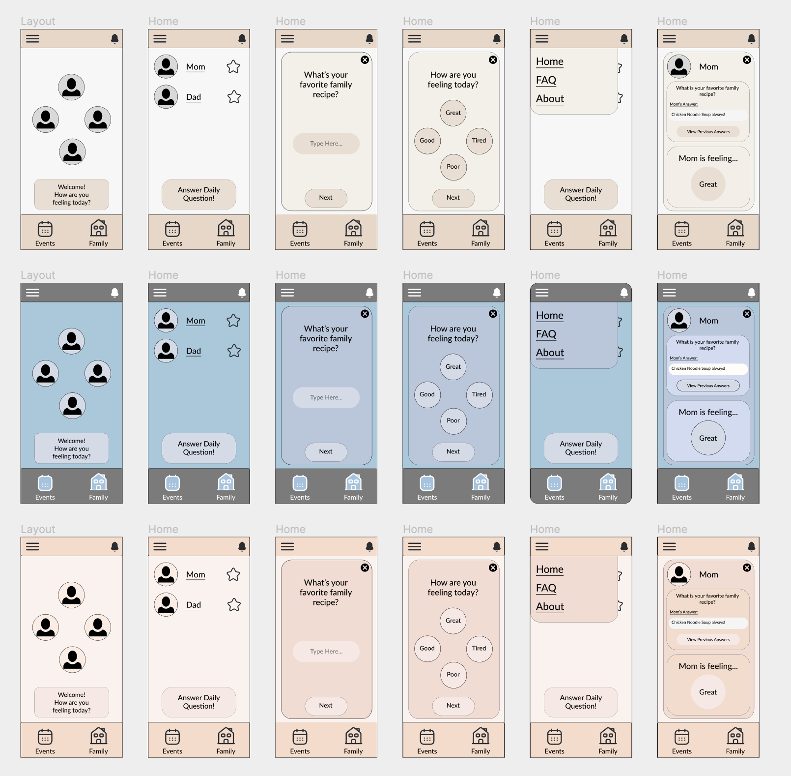

<h1>Interface Design</h1>
<h2>Project Description</h2>
The purpose of this project is to create a family connection app that incorporates the functionality of existing family organizational apps such as Cozi or Maple with extra features that motivate and support deeper emotional bonds between family members. Currently existing family apps serve as great bases for families looking to better organize events or keep a consolidated list of information for each member to see. However, many of these existing apps lack features that allow family members the opportunity to connect with each other and stay in tune with each other’s emotions even through a digitized space. The proposed app serves as a digital bridge for family members to connect, stay organized, and open conversations about each others emotions in an increasingly faster paced world. Good interface design will allow family members of all ages to participate and quickly pick up on the functions in the app and in turn learn more about each other through the use of specific features.

<h2>Digitized Wireflow</h2>
<a href="https://www.figma.com/file/TovH3HwMOyu7whBS2J3CIy/DH110Assignment6?type=design&node-id=0%3A1&t=YkLNr4qZ4VM0UQ2X-1">Link to Digitized Wireflow</a>

<h2>Graphical User Interface Design Variation</h2>
<h3>Layout</h3>

<h3>Typography</h3>

<h3>Shape</h3>

<h3>Colors</h3>

<h2>Final Graphical Interface Design</h2>

<h2>Accessibility Check</h2>
<table>
  <tr>
    <td></td>
    <td></td>
    <td></td>
  </tr>
</table>

<h2>Impression Test</h2>

<h2>Design Summary</h2>
<h3>Layout</h3>
6 Rows, 8% Opacity, 30 Margin, 15 Gutter
3 Columns, 8% Opacity, 15 Margin, 20 Gutter
<h3>Typography</h3>
Lato, 3% Letter Spacing, 32 Line Spacing, Regular
Sidebar: 40px
Button: 28px, 32 Line Spacing
Title Text: 32px, 36 Line Spacing
Paragraph Text: 24px, 30 Line Spacing
Sub Text: 16px
Main Tabs (Event, Family): 26px
<h3>Shape</h3>
Component Curve Radius: 40
<h3>Color</h3>
Background: FCF2ED
Top/Botton Bar: F8DBCA
Button: F9E9E4
Component: FFE4DB

<h2>Link to Interface Design</h2>
<a href="https://www.figma.com/file/TovH3HwMOyu7whBS2J3CIy/DH110Assignment6?type=design&node-id=0%3A1&t=YkLNr4qZ4VM0UQ2X-1">Interface Design Page</a>

