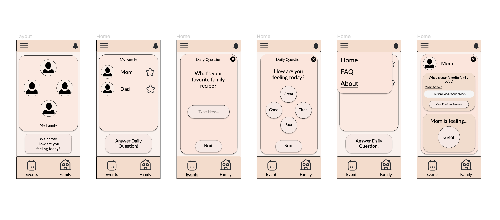

<!doctype html>
<html lang="en">
  <head>
    <!-- Required meta tags -->
    <meta charset="utf-8">
    <meta name="viewport" content="width=device-width, initial-scale=1, shrink-to-fit=no">

    <!-- Bootstrap CSS -->
    <link rel="stylesheet" href="https://cdn.jsdelivr.net/npm/bootstrap@4.3.1/dist/css/bootstrap.min.css" integrity="sha384-ggOyR0iXCbMQv3Xipma34MD+dH/1fQ784/j6cY/iJTQUOhcWr7x9JvoRxT2MZw1T" crossorigin="anonymous">

    <title>Hello, world!</title>
  </head>
  <body>
    <h1>Hello, world!</h1>

  <h2>Alonzo Murrieta</h2>
  
Hi, this is my course website for DH110. 
The project I plan on working on is a family connection app that takes the features of current family connection apps (such as to-do lists, calendars, shared recipes, etc.) and implement features that allow for closer family connection. Specifically, this app will encourage family members to answer a daily question regarding emotions or thoughts about a specific topic in order to encourage a more open connection between family members.

    <h2>Project Inspiration</h2>

    <h2>Heuristic Evaluation</h2>

    <h2>Usability Testing</h2>

    <h2>User Research</h2>

    <h2>UX Storytelling</h2>

    <h2>Low-Fidelity Prototyping</h2>

    
    

    <h2>Interface Design</h2>

    

    <h2>High-Fidelity Prototyping</h2>

    

    <!-- Optional JavaScript -->
    <!-- jQuery first, then Popper.js, then Bootstrap JS -->
    
    
    
  </body>
</html>
